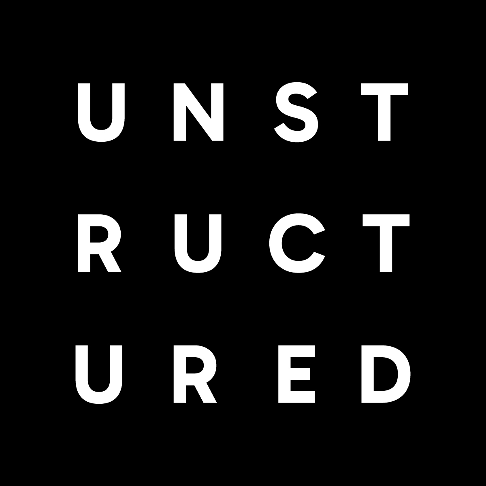

<h3 align="center">
  
</h3>

  

  
  
  
  

<h3 align="center">
  
The ETL+ Platform for GenAI

</h3>

Welcome to Unstructured! We're trusted by **82% of the Fortune 1000** and used by **over 60,000 organizations globally**.

We automatically transform complex, unstructured data into clean, **structured data** for GenAI applications. Data is routed through dynamic transformation and enrichment pipelines to deliver the highest quality output to your LLM. **Continuously. Effortlessly. Automatically.**

To get started, check out our open source offerings:
- [`unstructured`](https://github.com/Unstructured-IO/unstructured) - Core library for partitioning,
  cleaning, and chunking 25+ documents types for LLM applications and connecting to source and
  destination data source.
- [`unstructured-api`](https://github.com/Unstructured-IO/unstructured-api) - An open source API
  that wraps the `unstructured` Python library.
- [`unstructured-python-client`](https://github.com/Unstructured-IO/unstructured-python-client) -
  Python client library for our API.
- [`unstructured-js-client`](https://github.com/Unstructured-IO/unstructured-js-client) - JavaScript
  client library for our API.

Tried the open source library and ready for more? [Try Unstructured for free today](https://unstructured.io/developers) and experience the next evolution of ETL for GenAI applications.

## Learn more

| Section | Description |
|-|-|
| [Company Website](https://unstructured.io/) | Transform complex, unstructured data into clean, structured data. Securely. Continuously. Effortlessly. |
| [Extensive Documentation](https://docs.unstructured.io/welcome) | Our comprehensive docs cover everything from getting started guides to in-depth API references, ensuring you have the resources you need to succeed. |
| [Developer Community on Slack](https://short.unstructured.io/pzw05l7) | Connect with fellow developers, share knowledge, and get support through our vibrant community Slack channel. |
